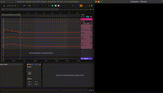
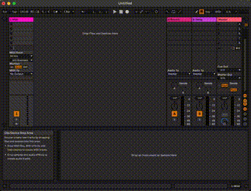

# Preamble
osc2laser (*OSC to laser*) is a completely free, open source, solution to **create stunning lasershows** - live or pre-programmed by timeline.

It enables you to simply control your showlasers via any OSC-compatible software.

*2D laser preview of animated timeline using Ableton Live*

# Features
- Easy laser output preview (2D)
- Multiple static and animated [laser objects](#laser-objects)
- Change [parameters](#parameters) of laser objects 
- Many [effects](#effects) for laser objects available

# System requirements
- Python 3 runtime
- Any supported Laser DAC:
  - [Helios Laser DAC](https://bitlasers.com/helios-laser-dac/)
- Any software for sending OSC commands like:
  - [open-stage-control](https://openstagecontrol.ammd.net/) (free)
  - [Ableton Live](https://www.ableton.com/live/)
  - [Vezér](https://imimot.com/vezer/)
  - [TouchOSC](https://hexler.net/touchosc)
  - Chataigne (free)
  - OSSIA score (free)
  - TWO (free)
  - OSC See
  - Millumin
  - QLab
  - ...

For *Max for Live* developers:
- [Max for Live](https://www.ableton.com/de/live/max-for-live/)

# Components
- *osc-senders/max-for-live-device/osc2laser.amxd*: Max for Live instrument 
- *osc-receiver*: The server component which receives OSC commands and translates them to a laser DAC.

# Quick Start
## OSC receiver
- Python 3:
  1. Install the Python 3 runtime which matches your operating system (Windows, Mac, Linux,...).
  2. Install virtual environment: `python -m venv venv`
  3. Change to venv: `source venv/bin/activate`
  4. Change to osc-receiver directory: `cd osc-receiver`
  5. Install requirements: `python -m pip install -r requirements.txt`
- Laser DAC driver:
  1. Get the right `osc-receiver/libHeliosDacAPI.so` from [here](https://github.com/Grix/helios_dac) to match your OS (driver for x86_64 macOS already included) 
- Run:
  1. Start OSC receiver: `python main.py`

This starts an OSC server on *localhost* at UDP port *2345*.
See *config_laser1.txt* for more optional settings.

## OSC sender
### open-stage-control

1. [Download](https://openstagecontrol.ammd.net/download/) and install software.
2. Run and open profile *osc-senders/open-stage-control/osc2laser-client.config*.
3. Click *play* icon.
4. Open session *osc-senders/open-stage-control/osc2laser-template.config*.

### Max for Live device

*Setup of the Max for Live device in Ableton Live*

1. Start Ableton Live
2. Create a new project
3. Switch to session view (*tab* key)
4. Drag `osc-senders/max-for-live-device/osc2laser.amxd` into the session window to create a new track.
5. Right click the UI elements (laser object, X position, Y position,...) to show its automation track in a new lane
6. Add key frames to the automation lanes and watch the output in the laser preview window.

# OSC messages
## Globals
- /globals/scan_rate
  - 100 to 40000: scan rate (points per second)

## Laser objects
- /laserobject
  - 0 = blank
  - 1 = green horizontal line
  - 2 = red vertical line
  - 3 = blue static wave
  - 4 = blue animated wave
  - 5 = green static circle
  - 6 = green static point
  - 7 = white static stars

## Parameters
- /parameters/wave_amplitude
  - 0-5000: Wave amplitude
- /parameters/wave_length
  - 5000-15000: Wave length
- /parameters/wave_speed
  - 0-75: Wave speed

## Effects
- /effect/x_pos and /effect/y_pos
  - -4095 to 4095: move X or Y position of laserobject
- /effect/xy_pos
  - (-4095 to 4095, -4095 to 4095): move X and Y position of laserobject at once
- /effect/rgb_intensity
  - 0 to 255: brightness of the RGB colors
- /effect/scale_factor
  - -10 to 10: scaling factor of shape (1 = no scale)
- /effect/rotation_degrees
  - 0 to 360: degrees of static rotation (0 = no static rotation)
- /effect/rotation_speed
  - 0 to 1024: speed of continuous rotation (0 = no continuous rotation)
- /effect/color_change/[r, g, b]
  - 0 to 255: color intensity of red, green and blue

## Example OSC senders
### Max for Live device
- UI input fields for network parameters (IP and port)

# Run installer (create binary)
## For Mac & Linux
- `cd osc-receiver`
- `venv/bin/pyinstaller --onefile --paths=venv/lib/python3.12/site-packages main.py`
- Run binary: `/dist/main`

# Support & Community
Join our [Discord](https://discord.gg/3JKDDWr9w6) server to discuss your ideas and issues with the community.

# Sponsors
- [goodtimes](https://www.goodtimes.technology) | Interactive showlaser technology: lasershows, laser art, laser games, laser control software
- [sync.blue®](https://www.sync.blue) | Technology partner 
