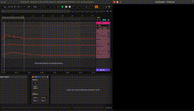

# Preamble
osc2laser (*OSC to laser*) is a completely free, open source, solution to **create stunning lasershows** - live or by pre-programmed by timeline.

It enables you to simply control your showlasers via any OSC-compatible software (Ableton Live, TouchOSC, Vezér,...).

*2D laser preview of animated timeline using Ableton Live*

# Release status
*Proof of concept* 

This projects is in an early stage to get feedback and to urgently find more contributors. Not ready for production usage.

# Features
- Laser output preview (2D)

- Pre-defined laser objects

- Effects:
  - X position
  - Y position

# System requirements
- Python 3 runtime
- Any supported Laser DAC:
  - [Helios Laser DAC](https://bitlasers.com/helios-laser-dac/)
- Any software for sending OSC commands like:
  - [Ableton Live](https://www.ableton.com/live/)
  - [Vezér](https://imimot.com/vezer/)
  - [TouchOSC](https://hexler.net/touchosc)
  - ...

For *Max for Live* developers:
- [Max for Live](https://www.ableton.com/de/live/max-for-live/)

# Components
- *osc-senders/max-for-live-device/osc2laser.amxd*: Max for Live instrument 
- *osc-receiver*: The server component which receives OSC commands and translates them to a laser DAC.

# Quick Start
## OSC receiver
- Setup Python 3
  - Install the Python 3 runtime which matches your operating system (Windows, Mac, Linux,...).
  - Install virtual environment: `python -m venv venv`
  - Change to venv: `source venv/bin/activate`
  - Change to osc-receiver directory: `cd osc-receiver`
  - Install requirements: `python -m pip install -r requirements.txt`
- Run OSC receiver: `python main.py`

This starts an OSC server on *localhost* at UDP port *2345*.
See *config_laser1.txt* for more optional settings.

# OSC messages
- /laserobject
  - 0 = blank
  - 1 = green horizontal line
  - 2 = red vertical line
  - 3 = blue static wave
- /effect/x_pos and /effect/x_pos
  - -4095 to 4095: move X or Y position of laserobject

# Roadmap
This is what needs to be worked on. 

As a user, feel free to create any issue.

If you are Python developer, feel free to create a pull request. 

## OSC receiver
- More docs
  - Quick Setup for *Max for Live device* 
- More installers
  - MacOS
  - Windows
  - Linux
- More laser objects
  - Circle
  - ILDA file
  - SVG file
  - ...
- More laser effects
  - Scale
  - Rotate
  - Dots
  - Scan rate
  - ...
- More laser DACs
  - EtherDream
  - ShowNet
  - Pangolin FB3/FB4
  - Moncha
  - LaserCube
  - ...
- More OSC sender examples
  - Python script

## Example OSC senders
### Max for Live device
- UI input fields for network parameters (IP and port)

# Sponsors
- [goodtimes](https://www.goodtimes.technology) | Lasershows
- [sync.blue®](https://www.sync.blue) | Technology partner